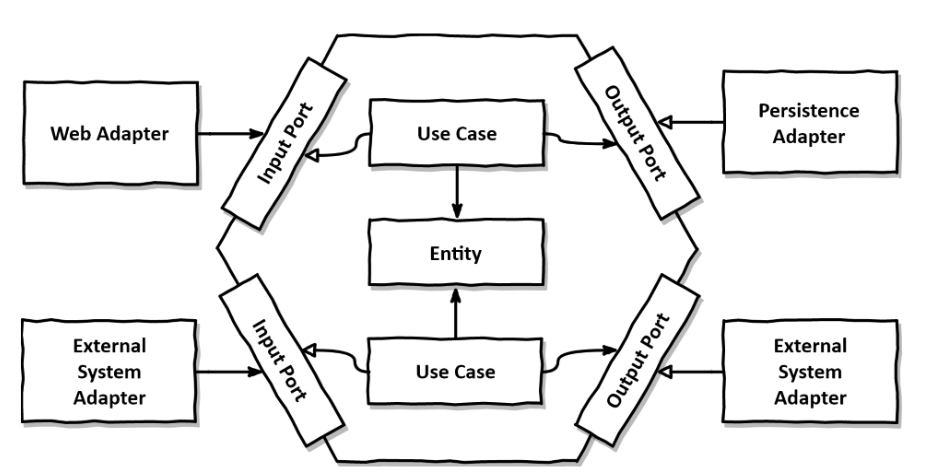

# TP MIAGE conception logicielle

## Nom du(des) étudiant(e)(s) de ce monôme/binôme 

WARNING: **NE PAS OUBLIER DE MENTIONNER ICI LES NOMS DE TOUS LES MEMBRES DU BINOME. SEULS LES NOMS ICI PRESENTS SERONT NOTÉS. PAS LA PEINE DE ME PRÉVENIR PAR MAIL, JE CONSULTE UNIQUEMENT LES FORKS GITHUB DE MON DEPOT.**

#Léo LUCAS# (et #Gautier BERNARDET#)

Commentaires éventuels des étudiants : #XXXXXX#

## Pré-requis 

* Disposer d'un PC d'au moins 8 Gio de RAM avec 20 Gio de disque disponible ; Un PC par binôme suffit, choisir le plus puissant (avec le plus de RAM).
* Disposer d'une connexion internet hors université pendant le TP (le réseau de l'université semble bloquer un certain nombre de choses). En cas d'urgence, je peux fournir de la data.
* Disposer d'un compte Github par personne (ou un pour deux personnes si vous êtes en binôme) et avoir https://docs.github.com/en/authentication/keeping-your-account-and-data-secure/creating-a-personal-access-token[créé un access token] avec le groupe de droits `repo`, le faire depuis https://github.com/settings/tokens[ici];

## Environnement de développement

Deux options sont possibles :

### Option 1 [préférée] - Utiliser la VM fournie

Télécharger, décompresser et *tester* cette https://public.florat.net/cours_miage/vm-tp-miage.ova[image VirtualBox] *avant le TP*. Elle contient tous les outils nécessaires (Intellij IDEA, DBeaver, client REST Insomnia, Firefox...).

Le login/mot de passe est : `vagrant`/`vagrant`.

IMPORTANT: Si pas déjà fait, activer les fonctions de virtualisation CPU dans votre BIOS/UEFI (option `AMD-V` ou `Intel VT` en général) sinon votre VM sera extrêmement lente et inutilisable. Une version récente de VirtualBox est également nécessaire.

### Option 2 - Installer les outils soit même sur votre machine

* Disposer d’un IDE (de préférence Intellij IDEA CE, Eclipse ou VSCode) supportant le Java et Maven.
* Disposer d’une installation de Docker.
* Disposer d’un client de test REST (Insomnia ou Postman conseillés).
* Disposer d’un explorer de base de donnée (DBeaver conseillé).

## Déroulement du TP

* Répondre aux questions de la feuille de TP juste sous la question (en modifiant, commitant puis poussant le fichier `README.adoc`).

Nous fournissons différents projets IDEA servant de base de travail aux exercices suivant. Cela permet un point de synchronisation de tous les étudiants à différents moments du TP.

IMPORTANT: Vous ne pourrez pas faire de `push` avec votre mot de passe (Github n'autorise plus que les access tokens), veuillez utiliser login/<access token> (voir pré-requis plus haut pour le créer).

### Exercice 1 - Etudier une API REST sans couches
_Temps estimé : 40 mins_

* Importer dans IDEA les projets depuis le VCS (URL : `https://github.com/<x>/tp-miage-<YYYY>.git`.

TIP: [Rappel Git] Trois dépôts sont ici utilisés : le dépot Github de l'enseignant (`bflorat/tp-miage-<YYYY>`), le dépot Github du binôme (`<x>/tp-miage-<YYYY>`), le dépot local sur le portable de l'un ou des deux étudiants du binôme.

* Observer le code du projet `todolist-debut-ex1`

*Le code est-il structuré en couches ? Quel problèmes ce code peut-il poser ?*

**Problème de structure du projet**

Le code n'est pas organisé en **architecture en couches**.
Tout se trouve dans le même package `com.acme.todolist` et les responsabilités sont mélangées.

**Problèmes observés** :

- Le contrôleur web `TodoListController` gère à la fois : le routage HTTP, la logique métier et l'accès à la base de données via `TodoItemRepository`.

- La classe `TodoItem` sert à la fois : d'entité JPA (modèle base de donnée) et de DTO (objet envoyé dans l'API).

**Conséquences**

- Le contrôleur devient difficile à maintenir car il mélange plusieurs responsabilités.
- La logique métier ne peut pas être réutilisée ailleurs sans passer par le contrôleur.
- Une modification de la base de données modifie directement le format de réponse de l’API.

*Où se trouve le code métier (voir la règle de gestion RG 1) ?*
Le code métier est codé directement à l'intérieur du contrôleur dans la classe `TodoListController`
dans la méthode `todoItems()` et plus spécifiquement implémenté dans la méthode `finalContent()`

*Cette règle est-elle facilement testable par un test unitaire ?*
Non cette règle est difficilement testable dans cet état :

- La méthode est privée ce qui empêche de la tester isolément
- Il y a également de lourdes dépendances
- On ne peut pas contrôler le temps, l'usage de `Instant.now()` empêche de figer l'heure

* Lancer une base PostgreSQL en Docker dans un terminal (on lance ici la base en mode interactif pour visualiser son activité. Pour la lancer en tâche de fond, remplacer les options `it` par `d` comme 'daemon'):
```bash
docker run -it -e POSTGRES_PASSWORD=password -p 5432:5432 postgres
```
*Expliquer cette ligne de commande (y compris les options utilisées)*
La commande permet de lancer instantanémment une base de données PostgreSQL isolée sur notre machine, sans avoir à installer le logiciel sur notre système d'exploitation

**Les détails de la commande** :

- `docker run` : Crée et redémarre un nouveau conteneur
- `-it` : Mode interactif avec le terminal (permet de voir les logs en direct)
- `-e POSTGRES_PASSWORD=password` : Définit une variable d'environnement pour configurer le mot de passe de la base de donnée
- `-p 5432:5432` : Redirige le port 5432 de l'ordinateur vers le port 5432 du conteneur (pour se connecter à la base de donnée depuis l'extérieur du conteneur)
- `postgres` : Utilise l'image officielle PostgreSQL

*Compléter le code manquant dans la méthode `TodoListController.createTodoItem()`*

*Pourquoi `todoItemRepository` est-il `null` ? Quelle est la meilleure façon de l'injecter ?*

La raison pour laquelle `todoItemRepository` est null est due à la présence de deux constructeurs dans la classe `TodoListController`
Comme on a pas mis d'annotation `@Autowired`, Spring cherche le constructeur le plus simple et il choisit alors le constructeur vide.
donc le code `this.todoItemRepository = todoItemRepository` n'est jamais exécuté.
La meilleure pratique est l'injection par constructeur, il faut :

- Supprimer le constructeur vide pour forcer Spring à utiliser celui avec les paramètres
- Ajouter le mot-clé `final` devant le repository pour garantir qu'il soit initialisé et immuable.

Ainsi on aura plus de NullPointerException et ça simplifiera les tests en injectant un mock directement dans le constructeur.

* Modifier le code en conséquence.

* Tester vos endpoints avec un client REST.


[NOTE]
====
* Les URL des endpoints sont renseignées dans le contrôleur via les annotation `@...Mapping` 
* Exemple de body JSON : 

```json
{
    "id": "0f8-06eb17ba8d34",
    "time": "2020-02-27T10:31:43Z",
    "content": "Faire les courses"
  }
```
====

NOTE: Pour lancer l'application Spring, sélectionner la classe `TodolistApplication` et faire bouton droit -> 'Run as' -> 'Java Application'.

* Quand le nouveau endpoint fonctionne, commiter, faire un push vers Github.

* Vérifier avec DBeaver que les données sont bien en base PostgreSQL.

### Exercice 2 - Refactoring en architecture hexagonale
_Temps estimé : 1 h 20_

* Partir du projet `todolist-debut-ex2`

NOTE: Le projet a été réusiné suivant les principes de l'architecture hexagonale : 


Source : http://leanpub.com/get-your-hands-dirty-on-clean-architecture[Tom Hombergs]

* Nous avons découpé le coeur en deux couches : 
  - la couche `application` qui contient tous les contrats : ports (interfaces) et les implémentations des ports d'entrée (ou "use case") et qui servent à orchestrer les entités.
  - la couche `domain` qui contient les entités (au sens DDD, pas au sens JPA). En général des classes complexes (méthodes riches, relations entre les entités)

*Rappeler en quelques lignes les grands principes de l'architecture hexagonale.*
Dans l'architecture hexagonale on va retrouver :

- Le coeur (Le domaine) : C'est le cerveau de l'application. Il contient la logique métier pure.
Il est totalement isolé et ne doit rien connaître de Spring, des bases de données ou du web.
- Les ports (Les contrats) : Ce sont les interfaces qui servent de frontières à l'hexagone :
- Points d'entrée : Ce que l'extérieur peut demander au domaine (ex: `AjouterUneTache`)
- Ports de sortie : Ce dont le domaine a besoin pour fonctionner (ex: `SauvegarderUneTache`)
- Les adaptateurs (La technique) : C'est le code qui fait le pont entre le monde extérieur et les ports :
- Adaptateur d'entrée : Un contrôleur REST qui traduit une requête HTTP pour appeler le domaine.
- Adaptateur de sortie : Une classe Repository qui traduit les besoins du domaine en requête SQL.

Avec l'architecture hexagonale : c'est l'infrastructure qui dépend du domaine et jamais l'inverse.
Ça améliore également la testabilité.


Compléter ce code avec une fonctionnalité de création de `TodoItem`  persisté en base et appelé depuis un endpoint REST `POST /todos` qui :

* prend un `TodoItem` au format JSON dans le body (voir exemple de contenu plus haut);
* renvoie un code `201` en cas de succès. 

La fonctionnalité à implémenter est contractualisée par le port d'entrée `AddTodoItem`.

### Exercice 3 - Ecriture de tests
_Temps estimé : 20 mins_

* Rester sur le même code que l'exercice 2

* Implémenter (en junit) des TU portant sur la règle de gestion qui consiste à afficher `[LATE!]` dans la description d'un item en retard de plus de 24h.

*Quels famille de tests devra-t-on écrire pour les adaptateurs ?*
Dans une architecture hexagonale, on teste les adaptateurs séparément du coeur métier :

- Adaptateurs d'entrée :

*S'il vous reste du temps, écrire quelques-uns de ces tests.*

[TIP]
=====
- Pour tester l'adapter REST, utiliser l'annotation `@WebMvcTest(controllers = TodoListController.class)`
- Voir cette https://spring.io/guides/gs/testing-web/[documentation]
=====


